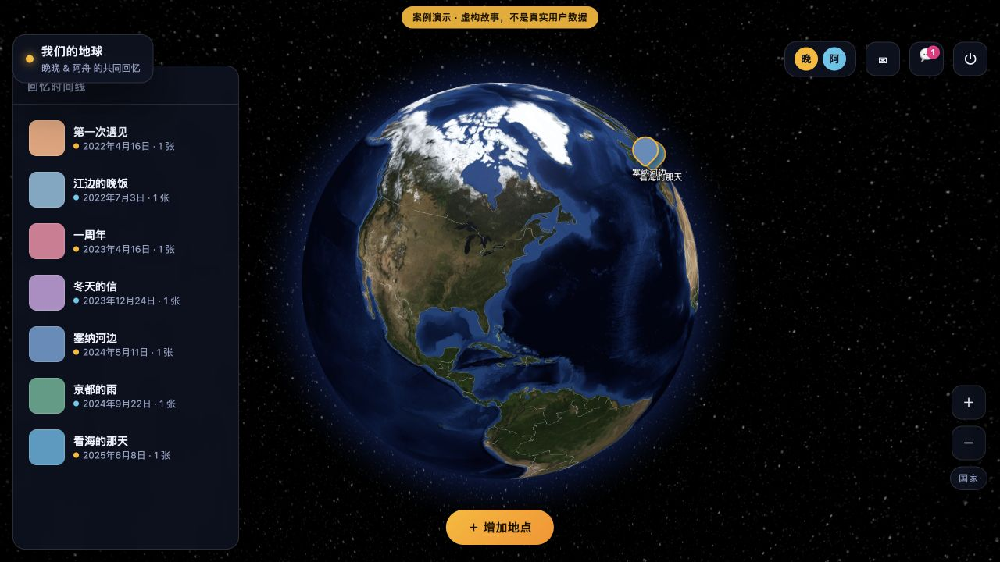

# Globe Memories · 我们的地球

**把情侣的照片、地点和想说的话，留在一颗可以共同回看的地球上。**

产品设计作品集 · 可运行 Web 原型 · AI coding 辅助实现

[查看产品 case](docs/product-case.md) · [90 秒演示路线](demo/README.md) · [设计取舍](docs/decisions.md) · [验证记录](docs/verification.md)



> 对外展示的是模板地球。账号、故事与图片均为虚构示例，不包含私人回忆；页面截图来自实际运行的产品。

## 为什么做

这个项目起于一个具体需求：**记录情侣之间的瞬间、照片和回忆**。产品把一段回忆组织成「地点 + 日期 + 照片 + 文字」，让两个人既能在地球上重新发现去过的地方，也能沿时间线找到某个时刻，再围绕它继续留言。

目标用户是希望共同记录生活的情侣。核心场景是一次经历后的记录、重返同一地点时的回看，以及不在同一时间打开产品时的交流。“按地点找回忆是否更自然、是否愿意持续共同记录”是待验证的产品假设，尚无用户研究或留存数据支持。

## 我的角色

**Cillian Wang｜全程产品设计，使用 AI coding 实现。** 我负责产品设计，AI coding 用于将设计转成可运行代码。当前作品展示产品方案、真实迭代和实现边界；不将 AI 生成代码表述为完全手写，也不把该产品描述为已接入大模型的 AI 应用。

## 核心体验

- **记录一个瞬间：** 点击「增加地点」，填写标题、日期、地点与文字，可附多张照片。
- **从空间与时间回看：** 3D 地球承载地点，时间线提供直接入口；点击回忆打开详情。
- **展开同一带的多段回忆：** 邻近地点聚合成一个气泡，再展开拍立得卡片，避免只看得到一段故事。
- **继续共同记录：** 原产品支持邀请码加入、共享浏览、地点关联留言与未读提示；公开模板使用示例账号，关闭新用户注册。

## 三个值得展开的产品决策

1. **探索与新增分开。** 迭代后点击地球用于回看，「增加地点」承担创建动作，减少浏览时意外进入填写流程的机会；实际误触率未测量。
2. **同地点聚合，但保留每段故事。** 当前以 15 km 邻接关系分组，点开后逐段浏览。阈值是实现参数，尚未经过用户测试证明最优。
3. **展示与私人数据隔离。** 模板复用原产品功能，用独立示例数据和会话；本仓库新增的公开入口只开放 `/demo`，不启动私人备份恢复流程。

具体演进与提交证据见 [产品决策](docs/decisions.md)。

## 当前成果与验证

已形成包含记录、浏览、留言与示例数据的可运行原型，并提供真实截图和可重复的验证方式。**尚无真实用户规模、留存、满意度或效率提升数据。** 本次功能检查只证明受测路径可运行，不代表市场需求已验证。

下一步优先观察：首次记录完成率、指定回忆找回成功率、双方共同记录比例。口径、测试任务与失败判定见 [指标与验证计划](docs/evaluation.md)。

## AI 与技术

- **现有实现：** FastAPI + SQLite；原生 HTML/CSS/JavaScript；globe.gl 展示地球；Pillow 压缩图片；Nominatim 提供地名搜索。
- **AI 的实际作用：** 辅助编写代码。运行时没有模型推理、RAG、训练数据或模型评测链路，具体 coding 工具与模型未记录。
- **可探索方向：** 从用户提供的文字中提取日期、地点候选，减少重复填写；必须由用户确认，且先与非 AI 流程对比。该能力未实现。

[技术结构与限制](docs/technical.md) · [AI 方案边界](docs/ai-scope.md)

## 运行模板 Demo

使用 Python 3.13（本次验证环境）。

```bash
python3 -m venv .venv
.venv/bin/python -m pip install -r requirements.txt
.venv/bin/python -m uvicorn demo.app:app --host 127.0.0.1 --port 8000
```

打开 **http://localhost:8000/**，自动进入模板地球。示例账号 `demo`，密码 `demo2026`，登录页自动填入。也可执行 `bash start.sh`。

- 模板含 7 段虚构回忆、7 张程序生成的色块图片和 2 个示例账号；数字仅描述 Demo 数据。
- 示例地球在每次服务启动时重建。所有访客共享同一份演示数据，写入内容可能被其他访客看到，重启后清空。
- 地球贴图和脚本在仓库内；地名查询依赖网络。当前前端在填写地点但无法搜索时会阻止保存，不能宣称完整离线可用。
- 本仓库默认入口只运行模板。对外部署应使用独立服务，见 [部署说明](DEPLOY.md)。

## 仓库导航

```text
globe-memories-portfolio/
├── README.md                 # 面试官首页
├── docs/
│   ├── product-case.md       # 背景、用户、目标与功能结构
│   ├── decisions.md          # 有提交证据的产品取舍
│   ├── technical.md          # 技术链路与限制
│   ├── ai-scope.md           # AI coding 与未来 AI 能力的边界
│   ├── evaluation.md         # 指标、任务与验证计划
│   ├── verification.md       # 本次实际检查结果
│   ├── evidence.md           # 事实来源与尚待确认内容
│   ├── 导学-地球回忆.md       # 阅读路径
│   └── 面经-地球回忆.md       # 2 分钟介绍、STAR 与追问
├── demo/                     # 仅模板的服务入口与演示指南
├── assets/screenshots/       # 模板真实截图
├── app/                      # 原有后端，保持不变
├── static/                   # 原有前端与地球资源，保持不变
├── scripts/                  # 验证与不含运行数据的打包工具
├── requirements.txt
├── start.sh
├── Dockerfile
├── docker-compose.yml
├── render.yaml               # 可选的独立演示部署配置
└── DEPLOY.md
```

技术面试可从 [源码阅读路径](docs/导学-地球回忆.md) 开始；产品面试可从 [STAR 与产品 case](docs/面经-地球回忆.md) 开始。
