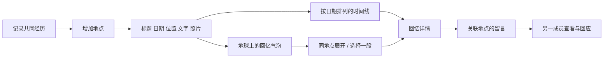

# 产品 case｜让两个人共同保存和回看一段经历

## 1. 背景与问题定义

项目作者确认：最初是为了记录情侣之间的瞬间、照片和回忆，由本人全程设计，使用 AI coding 实现。

由此整理出的产品问题是：如何把一次共同经历中的照片、时间、地点与文字组织起来，让双方日后能够找到，并继续补充交流？“照片与对话分散、难以回忆发生地点”可以作为后续研究的切入点，当前没有访谈记录证明其频率或严重性。

## 2. 用户与场景

核心用户：愿意共同记录经历的情侣，不以陌生人社交为目标。

- 记录时：一次约会或旅行之后，希望保存地点、日期、照片和当时想说的话。摩擦假设是填写成本高、记录延迟；待测。
- 回看时：想找“那次在同一个城市发生的事”，需要空间入口，也需要时间线兜底。同一地点多条记录重叠有代码迭代证据。
- 交流时：一方打开某段回忆后留下回应，另一方稍后看见；当前采用关联地点的留言与未读提示。

不使用编造的人物画像、访谈引语或调研样本数。关系类型来自作者描述；使用频率、付费意愿和更广泛目标市场尚未验证。

## 3. 目标与核心价值

目标：让用户完成「记录 → 找回 → 围绕回忆交流」闭环。

价值主张：让一段经历有共同可回看的位置，而不只是一张孤立照片。地球提供地点线索和情感表达，时间线帮助快速找回，留言把过去的记录延续为当下的交流。

本版不承担公共内容分发、陌生人匹配、推荐算法、商业化和多租户服务。代码支持受邀多成员，界面叙事面向情侣，并没有强制“最多两人”。

## 4. 产品方案与功能结构

原产品支撑：邀请码加入、成员共享浏览、只允许作者修改或删除自己的地点；照片删除权限跟随地点作者。公开模板保留核心体验并使用预设账号，不接受注册。

## 5. 关键路径验收

- 记录：输入标题和坐标，附图片，保存后时间线与详情呈现同一条记录。
- 回看：同一聚合区域中的多条回忆均能独立打开；标题、日期和作者不能混淆。
- 交流：从详情关联地点后发送留言，可从标签回到该回忆。
- 公开演示：首页明确虚构内容；公开入口不能访问原私人 API；重启重建示例。

## 6. 本次整理与原项目的边界

原有实现的功能和迭代来自源码及历史提交。本次新增产品叙事、指标方案、面试材料和公开模板入口；这些材料是回顾性整理，不冒充开发前就写好的 PRD 或已执行的研究。

## 7. 下一轮研究

建议先招募 3–5 对自愿参与的情侣，用其自选的非敏感示例完成记录、找回与回应任务。观察卡点，追问当前做法和是否愿意再次使用。样本量是建议，不是已开展研究；没有验证前不做市场规模或增长结论。
