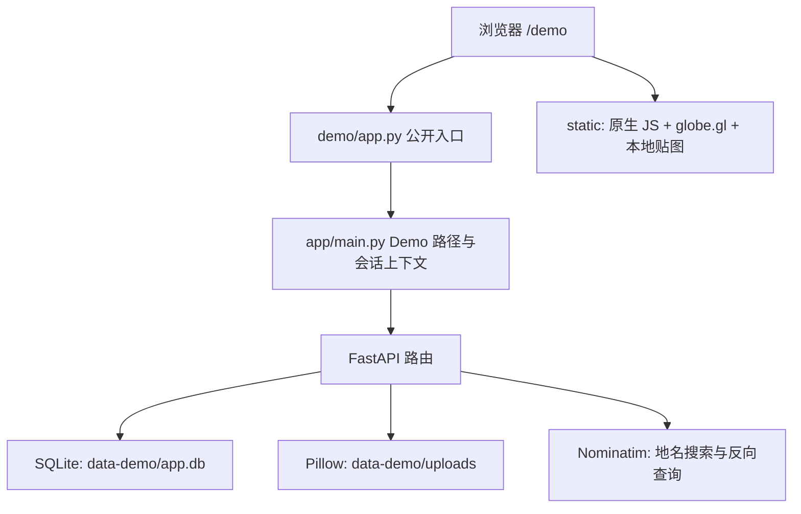

# 技术链路与实现边界

## 运行结构

公开入口只初始化示例数据，不进入私人恢复、密码重置或备份生命周期。原有私人服务代码保留用于源码阅读，不在默认入口开放。

## 一次记录如何保存

1. 底部按钮打开表单，初始坐标来自当前地球视角。
2. 输入地点后调用后端代理查询，选候选更新坐标。若填了地点但未选候选，保存时再次查询；无结果时报错。
3. 后端验证标题、坐标，按已有规则纠偏地名与坐标，再写入地点记录。
4. 图片经 Pillow 解码、按方向修正并转 JPEG；长边上限 1800 px，缩略图 480 px，单张限制 20 MiB。
5. 前端重新加载回忆，更新地球与时间线，并打开新记录。

这里保存的是压缩后的 JPEG，不是原始文件的无损备份。声明支持的 MIME 类型不等于实际解码支持；HEIC 在未额外安装解码器的环境下不保证可用。

## 数据结构

`users` 成员；`invites` 邀请；`places` 地点/回忆；`photos` 附图；`messages` 留言；`reads` 已读位置。SQLite 启用外键与 WAL。多个受邀成员共享同一地球，没有独立情侣空间标识。

## 认证与隔离

PBKDF2-SHA256 保存密码哈希，签名 Cookie 保存会话；Demo 与私人路径使用不同 Cookie、签名上下文与数据目录。照片接口要求登录；地点修改/删除、照片删除检查作者。Cookie 有客户端有效期，但签名读取本身没有服务端时间戳过期验证；不应描述为完整会话治理。

模板是共享可写演示环境，不是多租户隔离服务。公开账号不能存放私人内容。本次未进行全面安全审计，也没有生产级抗滥用或并发验证结论。

## 原有备份设计

`app/cloudbackup.py` 包含按需/周期备份、空库恢复和按记录数量阻止较少数据覆盖的保护逻辑。默认周期以实现为准是 1 小时，原模块注释中的 12 小时已不一致。公开模板不使用这些能力；本次没有读取私人数据库或接入私人备份。

## 规模与体验限制

- 聚合按两两距离比较，规模增长需测量计算时间；15 km 是邻接阈值，不是整组直径上限。
- 留言轮询间隔 4 秒，不是实时双向通信。
- 地球资源本地化不代表全部功能离线可用；搜索和部分坐标修正依赖网络。
- 未验证移动设备真实手势、低性能 GPU、多人并发、跨平台部署及备份恢复演练。

依赖版本以 `requirements.txt` 为准；本次运行结果见 [验证记录](verification.md)。
